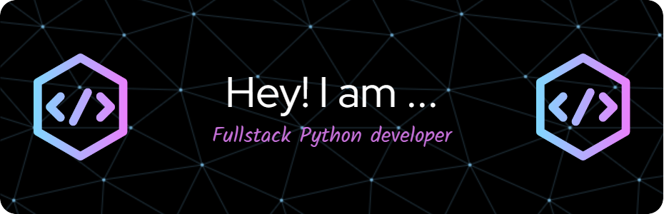

<h1 align="center">Hi 👋, I'm Rishav Raj</h1>
<h3 align="center">I'm a Python developer with a passion for building user-friendly web applications and automating data collection with web scraping. I'm experienced in Django, frontend development, and MySQL, and I'm always eager to learn and experiment with new tools and frameworks. Let's build something great together!</h3>

  

  

  

- 🌱 I’m currently learning **Flask**

- 💬 Ask me about **Python,Web Scraping,Django**

- 📫 How to reach me **rajrishav543256@gmail.com**

<h3 align="left">Connect with me:</h3>

<h3 align="left">Languages and Tools:</h3>

            

&nbsp;

